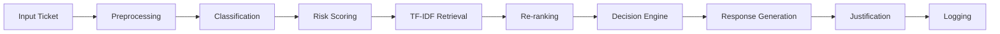

# 🚀 Rule-Based Support Ticket Automation


A **terminal-based, deterministic support ticket pipeline** that classifies, risk-scores, retrieves knowledge, ranks evidence, makes escalation decisions, and generates responses with **100% explainability**.

Unlike LLM-powered systems, every decision is **rule-driven, reproducible, and fully auditable**.

---

# ✨ Features

- 🔍 Automatic ticket classification
- ⚠️ Rule-based risk scoring
- 📚 TF-IDF knowledge retrieval
- 📈 Document re-ranking
- 🤖 Response generation
- 🚨 Intelligent escalation
- 📝 Full audit logging
- ❌ Zero hallucinations
- 🔄 Deterministic outputs

---

# 🌍 Supported Domains

| Product | Supported |
|----------|-----------|
| Visa Fraud | ✅ |
| Visa Billing | ✅ |
| HackerRank Assessments | ✅ |
| Authentication | ✅ |
| Claude AI | ✅ |

---

# 🏗 Pipeline Architecture



Every stage is deterministic.

**Same input → Same output**

---

# ⚙️ Pipeline Stages

| Stage | Description |
|--------|-------------|
| Preprocessing | Lowercase, remove punctuation, normalize whitespace |
| Classification | Detect request type and product area |
| Risk Scoring | Assign HIGH / MEDIUM / LOW |
| TF-IDF Retrieval | Retrieve Top-3 relevant documents |
| Re-ranking | Cosine similarity + keyword overlap |
| Decision Engine | Decide reply, escalation, or invalid |
| Response Generation | Extract best matching sentence |
| Justification | Explain every decision |
| Logging | Store full audit trail |

---

# 🚨 Escalation Rules

The pipeline **never guesses**.

Tickets are escalated when:

- Invalid request
- HIGH risk detected
- Unknown product
- No matching documents
- Similarity score below threshold (default **0.25**)

---

# 📂 Project Structure

```text
project/

├── main.py
├── agent.py
├── classifier.py
├── risk_detector.py
├── retriever.py
├── ranker.py
├── decision.py
├── response_generator.py
├── justification.py
├── logger.py
├── utils.py
│
├── data/
│   ├── visa_fraud.md
│   ├── visa_billing.md
│   ├── authentication.md
│   ├── claude_ai.md
│   └── general_routing.txt
│
├── support_tickets/
│   ├── support_tickets.csv
│   └── output.csv
│
└── log.txt
```

---

# 📦 Installation

```bash
git clone <repository-url>

cd project

pip install -r requirements.txt
```

Requirements

- Python 3.8+
- pandas
- scikit-learn

---

# ▶️ Usage

Default execution

```bash
python main.py
```

Custom paths

```bash
python main.py <input_csv> <output_csv> <data_dir> <log_path>
```

Example

```bash
python main.py \
../support_tickets/support_tickets.csv \
../support_tickets/output.csv \
../data \
../log.txt
```

---

# 📥 Input Format

| Column | Required | Description |
|----------|----------|-------------|
| subject | ✅ | Ticket title |
| issue | ✅ | Ticket description |
| company | Optional | Product override |

---

# 📤 Output Format

| Column | Description |
|----------|-------------|
| status | replied / escalated / invalid |
| response | Generated response |
| justification | Decision explanation |

---

# 🧠 Engineering Decisions

## ✅ Zero Hallucinations

Responses are extracted directly from the local knowledge base.

---

## ✅ Fully Deterministic

Explicit tie-breaking ensures identical outputs for identical inputs.

---

## ✅ Explainable AI

Every prediction includes:

- matched keywords
- similarity score
- retrieval evidence
- decision reason

---

## ✅ Offline

- No internet
- No APIs
- No cloud
- No LLM

---

## ✅ Complete Audit Trail

Every ticket generates a detailed log.

Example:

```text
Ticket #21

Classification:
Product: Visa Fraud

Risk:
HIGH

Top Documents:
visa_fraud.md (0.81)

Decision:
Escalated

Reason:
High-risk fraud keywords detected.
```

---

# 📚 Knowledge Base

Supported document types:

- `.md`
- `.txt`

Example corpus

```
visa_fraud.md
visa_billing.md
authentication.md
hackerrank_assessment.md
claude_ai.md
general_routing.txt
```

The TF-IDF vectorizer is built once at startup and reused throughout execution.

---

# 🎯 Design Philosophy

> Reliable AI does not always need the biggest model.
>
> It needs the right architecture, clear rules, deterministic behavior, and complete traceability.
